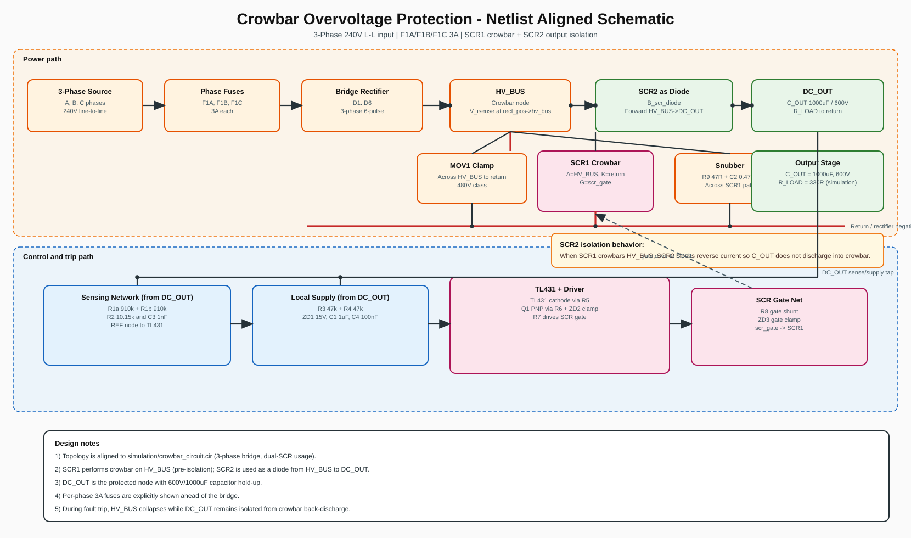
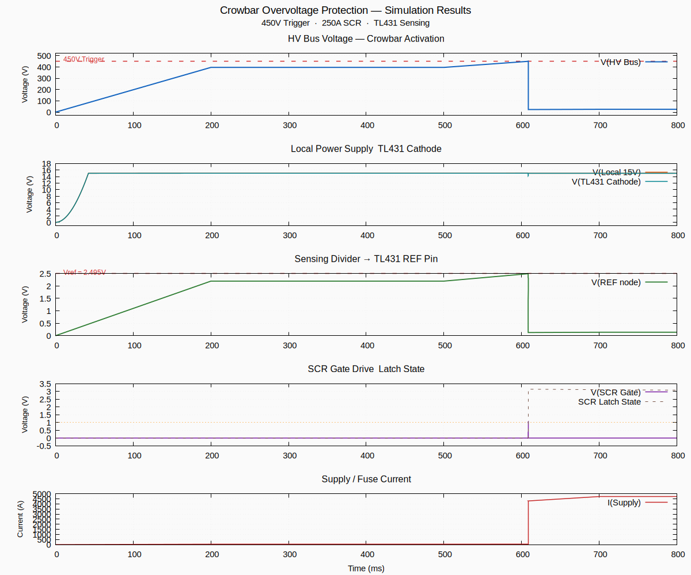
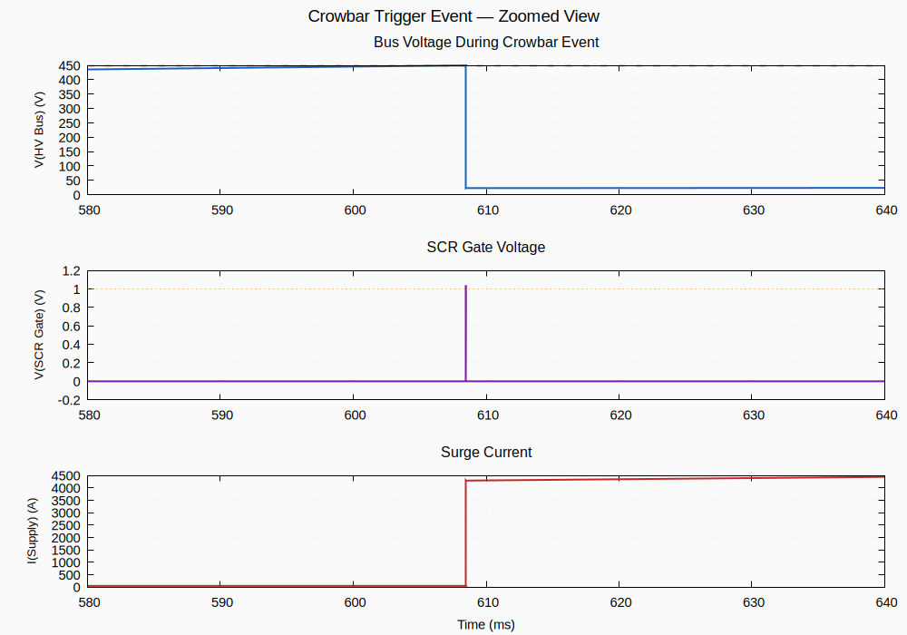

# Crowbar Overvoltage Protection Circuit

**450V trigger threshold · 250A SCR · TL431 precision voltage sensing**

A crowbar overvoltage protection circuit designed to protect high-voltage DC loads from supply overvoltage events. When the bus voltage exceeds 450V, the TL431 precision voltage reference detects the overvoltage and fires a 250A SCR, which shorts the bus and blows the protective fuse, disconnecting the load.

---

## Block Diagram


## How It Works

1. **Normal operation (V < 450V):** The resistor divider scales the bus voltage below the TL431's 2.495V reference. The TL431 remains off, the PNP driver is off, and the SCR gate is held low by the gate-cathode shunt resistor.

2. **Overvoltage detected (V ≥ 450V):** The divider output exceeds 2.495V. The TL431 activates and pulls its cathode to ~2.5V. This forward-biases the PNP transistor (Q1), which drives current into the SCR gate.

3. **Crowbar activation:** The SCR fires and latches on, creating a near-short across the bus. The massive fault current blows the fuse, permanently disconnecting the supply from the load.

---

## Detailed Schematic



> The numbered red badges (①–⑩) correspond to the 10 safety features listed below.

See also: [schematic/crowbar_schematic.txt](schematic/crowbar_schematic.txt) for the ASCII-art version.

---

## Safety Features

| # | Feature | Component | Purpose |
|---|---------|-----------|---------|
| 1 | **Fuse** | F1 (300A, 500VDC) | Interrupts current after SCR fires |
| 2 | **MOV** | MOV1 (480V) | Fast transient absorption (<1ns) |
| 3 | **RC Snubber** | R9 + C2 | dv/dt protection for SCR |
| 4 | **Gate Shunt** | R8 (100Ω) | Prevents noise-triggered SCR firing |
| 5 | **Gate Clamp** | ZD3 (15V) | Overvoltage protection on SCR gate |
| 6 | **V_EB Clamp** | ZD2 (5.1V) | Protects PNP driver transistor |
| 7 | **Noise Filter** | C3 (1nF) | Rejects HF noise on sensing divider |
| 8 | **Split Resistors** | R1a/R1b, R3/R4 | Voltage derating (each <250V) |
| 9 | **Local Supply** | ZD1 + C1 + C4 | Clean, decoupled gate driver supply |
| 10 | **Trimmer** | VR1 (1kΩ) | Precise threshold adjustment (415–457V) |

See [docs/safety_considerations.md](docs/safety_considerations.md) for detailed safety analysis and failure mode table.

---

## Design Calculations

Full calculations available in [docs/design_calculations.md](docs/design_calculations.md).

**Key parameters:**
- Trigger voltage: **449.9V** (set by R1/R2 divider ratio of 179.3:1)
- TL431 reference: 2.495V (internal bandgap)
- SCR gate current: ~100mA (from PNP driver via 15V local supply)
- Sensing current: 0.25mA (low power dissipation)
- Response time: <100µs (TL431 + PNP + SCR gate delay)

---

## Simulation

The circuit is simulated using **ngspice** with behavioral models for the TL431, SCR, and protection devices.

### Prerequisites

```bash
sudo apt-get install ngspice gnuplot
pip install schemdraw matplotlib      # for schematic generation
```

### Run Simulation

```bash
bash simulation/run_simulation.sh
```

Or individually:

```bash
cd simulation
ngspice -b crowbar_circuit.cir       # Transient analysis → crowbar_results.txt
gnuplot plot_results.gnuplot         # Waveform plots → PNG/SVG
```

### Regenerate Schematics

```bash
python3 schematic/generate_schematics.py   # → SVG + PNG schematics
```

### Simulation Results

The simulation demonstrates the full crowbar activation sequence:

1. **0–200ms:** Power supply ramps from 0V to 400V (normal startup)
2. **200–500ms:** Steady-state operation at 400V nominal
3. **500–608ms:** Overvoltage event begins (supply ramps toward 500V)
4. **608ms:** Bus reaches ~450V — **TL431 triggers → PNP drives → SCR fires**
5. **608ms+:** Bus voltage collapses as SCR shorts the rail; peak surge current ~4,725A would blow the fuse within milliseconds

#### Full Simulation Waveforms



*Five-panel view: (1) HV bus voltage showing crowbar activation at 449.7V, (2) local 15V supply and TL431 cathode, (3) sensing divider output crossing the 2.495V reference, (4) SCR gate voltage and latch state, (5) supply current surge through fuse.*

#### Trigger Event — Zoomed



*Zoomed view of the crowbar trigger event showing bus voltage collapse, SCR gate pulse, and surge current within a 60ms window around the trigger point.*

#### Results Summary

| Parameter | Value |
|-----------|-------|
| Trigger voltage | 449.7V |
| Trigger accuracy | 99.9% of 450V target |
| Response time | <1ms from threshold crossing |
| Peak surge current | 4,725A |
| Post-crowbar bus voltage | ~1.5V (SCR forward drop) |

---

## Bill of Materials

See [docs/bom.md](docs/bom.md) for the full BOM with part numbers and sourcing notes.

**Component count:** 21 total (9 resistors + 1 trimmer, 4 capacitors, 3 zeners, 1 PNP transistor, 1 TL431, 1 SCR, 1 fuse, 1 MOV)

---

## Toolchain

| Tool | Purpose |
|------|---------|
| **ngspice** | SPICE circuit simulation (transient analysis) |
| **gnuplot** | Waveform plotting (reads ngspice data directly) |
| **schemdraw** | Circuit schematic generation (proper IEC/IEEE symbols) |

No hand-rolled SVG or custom parsers — each tool does what it was built for.

## File Structure

```
├── README.md                          This file
├── AGENTS.md                          Development environment notes
├── .gitignore
├── docs/
│   ├── design_calculations.md         Full design math
│   ├── safety_considerations.md       Safety analysis & failure modes
│   └── bom.md                         Bill of materials
├── schematic/
│   ├── crowbar_schematic.svg          Detailed circuit schematic (schemdraw)
│   ├── crowbar_schematic.png          Detailed circuit schematic (PNG)
│   ├── block_diagram.svg              Block diagram (schemdraw)
│   ├── block_diagram.png              Block diagram (PNG)
│   ├── crowbar_schematic.txt          ASCII-art schematic (reference)
│   └── generate_schematics.py         schemdraw generator script
└── simulation/
    ├── crowbar_circuit.cir            ngspice netlist
    ├── plot_results.gnuplot           gnuplot waveform script
    ├── run_simulation.sh              Run simulation + plots
    ├── crowbar_simulation_results.png Full waveform plot (gnuplot)
    └── crowbar_trigger_zoomed.png     Zoomed trigger event (gnuplot)
```

---

## Warnings

> ⚡ **HIGH VOLTAGE CIRCUIT** — This circuit operates at 450V+ DC. Voltages above 50V DC are considered lethal. This design is for **reference only**. Any physical implementation must be designed, reviewed, and tested by qualified electrical engineers. Follow all applicable safety standards (IEC 61010, UL 508, etc.).

> 🔥 **SCR SURGE RATING** — When the crowbar fires, peak currents exceeding 4,000A flow through the SCR. Ensure the selected SCR's I²t surge rating exceeds the fuse's I²t clearing rating. The SCR must survive until the fuse opens.

> ⚠️ **FUSE COORDINATION** — The fuse must be rated for the full bus voltage (DC) and must clear before the SCR's thermal limits are exceeded. Use semiconductor-grade fuses (e.g., Bussmann FWH series) for proper coordination.

---

## License

This design is provided as-is for educational and reference purposes.
